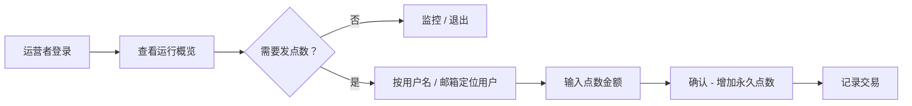
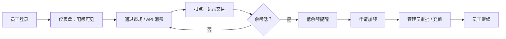

# AITokenPool — 产品用户故事（Product User Stories）

> **本文档以中文撰写**（用户故事主体、验收标准、流程说明均为中文；关键术语保留中英对照）。
>
> **v1.8（2026-08-17）· 移除面向用户文案中的防薅表述，文档措辞中性化.** 「防薅羊毛」是产品内部设计动机，不应出现在面向用户的界面文案中（UI 侧已同步移除）。本文档中的设计备注措辞中性化：「防薅动机」改为「设计意图」（如每日赠送机制的设计意图是**鼓励每日活跃**，同时降低集中注册多号的收益）。面向用户可见的赠送规则保持「每日赠送 1 点（当日有效）· 连续 10 天」。更新核心机制表「赠送点数」行措辞。
> **v1.7（2026-08-15）· 平台收益抽成 10%.** 平台从分享者收益中抽取 **10%**：消费者支付 N 点 → 分享者获得 **N × 90%**（按小数点数规则，保留 2 位小数）、**N × 10% 归平台**。示例：A 消费 B 的 key 10 点 → A 扣 10 点、B 收益 9 点、平台分 1 点。核心机制表新增「平台抽成 Platform fee」；分享者收益相关 AC 更新（收益 = 消费点数 × 90%）；新增边界场景 **E-16**（小数抽成精度，如消费 3 点 → 收益 2.7 点）；平台运营者角色补充：平台分成是运营收入来源。
> **v1.6（2026-08-15）· 点数锚定改为人民币（CNY）.** **1 点 ≈ 1 元人民币**（替代旧规则 1 USD = 1,000 点）；**消费点数可为小数**（按 token 用量 × 模型单价精确计费，可能产生小数点数；余额与交易金额保留 2 位小数，四舍五入）。模型定价：**CNY 模型直接 1 元 = 1 点**（如 GLM-5.2 输出 28 元/百万 → 28 点/百万）；**USD 模型按 ~7.2 汇率折算为人民币点数**（如 OpenAI 输出 $25/百万 ≈ 180 点/百万）。更新 US-1 / US-2 / US-6 / US-23 / 对齐表；新增 **E-15**（小数计费精度）。
> **v1.5（2026-08-15）· 改用中文撰写.** 全文主体改为中文：产品模型、角色定义、用户故事（「作为〈角色〉，我希望〈能力〉，以便〈价值〉」格式）、关键流程、边界场景等均以中文书写；关键术语中英对照（点数 Points、Key 池 Key pool、上架 Listing、消费 Consumption、收益 Earnings、API Key）；用户故事与验收标准（AC）用中文；保留 mermaid 流程图（图中文字中文化）。**内容与 v1.4 完全一致，仅语言变化，不引入新机制。**
> **v1.4（2026-08-15）· 修正新人赠送机制.** 旧的「注册即送 10 点（1 周有效）」**替换**为**每日赠送机制**：**每天送 1 点**（每日 1 点），每次赠送的点数**有效期 1 天**（当日有效，过期清零），**注册起连续 10 个自然日**每天发放 1 点（10 天后停止）；用户需**每天登录 / 回来**才能领取当日 1 点——未领取日的点数**不发、不积累**。不变：分享收益点数永久有效；未来充值点数永久有效；消费扣减顺序先扣有有效期的点数。设计意图：鼓励每日活跃，降低集中注册多号的收益。更新 US-3 / US-22 / US-23 / 流程 J-1 / 边界场景 E-13；新增 **E-14**（当日赠送未领取）。
> **v1.3（2026-08-14）· 明确平台运营者角色（运营者 = 宿主本人）.** 运营者是**部署者 / 拥有者（宿主本人）**，职责仅两项：**① 查看平台运行情况**（运行状态 / 用户数 / 共享 key 数 / 交易量 / 点数流动）和 **② 给指定用户充值点数**（永久有效点数，产生交易记录）。内容审核 / 违规处理 / 市场调节**明确排除**——保持最小。新增 US-运营1 / US-运营2（替换「规划中 Planned」占位）。
> **v1.2（2026-08-14）· 点数机制定案（纯分享经济）.** 每个注册用户赠送 **10 点**（新人体验券）有效 **1 周**；分享收益点数**永久有效**；未来充值点数**永久有效**。消费**先扣有有效期的（赠送）点数**。新增 US-22/23/24 与边界场景 E-13（赠送点数过期）。
> **v1.1（2026-08-14）· 结构调整.** 文档改为**先按部署场景、再按用户类型**组织（场景 → 用户类型 → 故事）：`## 公共场景 Public` / `## 企业场景 Enterprise`，每个场景下列出其用户类型及 Goals / Pain points / User stories / Key flows。复用 v1.0 内容，将归属重新按场景划分。
> **v1.0（2026-08-14）· 初始版本**（平铺的角色布局）。
> 核心产品设计文档。UI / 后端实现均以此文档为准。与 [docs/architecture.md](./architecture.md) 及 [`ui/`](../ui/) 中的 UI 原型对齐。

---

## 1. 产品模型与术语（Product Model & Terminology）

**一套产品，两种部署场景**（不是两套功能）：

- **公共版（Public edition）** — 部署在公网。任何人都能注册、分享闲置 API key 赚点数、用点数消费别人共享的模型。新注册用户进入**每日赠送机制**：**每天 1 点赠送点数**（仅当日有效），**注册起连续 10 个自然日**——详见下方核心机制表。
- **企业版（Enterprise edition）** — 部署在企业内网。管理员（IT）把采购的 key 放进 key 池，给成员分配每月点数配额。

功能集合**完全相同**；差异只在*谁有动力分享*（公共版人人可分享；企业版只有管理员）。**角色是权限差异，不是产品差异**——管理员额外拥有管理视图（key 池 / 成员 / 用量报表 / 组织），普通用户没有。

### 核心机制（Core mechanism）

| 术语 Term | 定义 Definition |
|---|---|
| **点数 Point** | 平台的计价单位。**1 点 ≈ 1 元人民币（CNY）**（替代旧规则 1 USD = 1,000 点）。**消费点数可为小数**——按 token 用量 × 模型单价精确计费，可能产生小数点数（如一次消费 0.37 点）；余额与交易金额显示保留 **2 位小数**（四舍五入）。 |
| **模型定价 Model pricing** | **CNY 模型直接 1 元 = 1 点**（如 GLM-5.2 输出 28 元/百万 tokens → 28 点/百万）；**USD 模型按 ~7.2 汇率折算为人民币点数**（如 OpenAI 输出 $25/百万 tokens ≈ 180 点/百万）。参考单价 = 模型输出价（点数 / 1M tokens）。 |
| **赠送点数 Gift points** | 新用户**每日赠送机制**：**每天 1 点**（每日 1 点），**注册起连续 10 个自然日**；每次赠送的点数**有效期 1 天**（当日有效，过期清零）。用户需**当天登录 / 回来领取**——未领取日的点数**不发、不积累**，第 10 天后停止赠送。设计意图：鼓励每日活跃，集中注册多号收益低。 |
| **收益点数 Earned points** | 分享 key 赚取的点数；**永久有效**——无有效期。 |
| **充值点数 Top-up points** | 未来充值获得的点数；**永久有效**（充值功能当前暂不支持，但规则先定）。 |
| **扣减顺序 Deduction order** | 消费**先扣有有效期的（赠送）点数**，再扣永久点数——有效期内点数不浪费，永久点数不会因过期竞争而损失。 |
| **Key 池 Key pool** | 平台托管的模型上游 API key（静态加密存储）。企业版：管理员上传；公共版：分享者上传。 |
| **上架 Listing** | 分享者上架一个闲置 key 并声明配额。**单价不由分享者设定**——平台按模型价格表自动定价（参考单价 = 模型输出价，点数 / 1M tokens）。 |
| **消费 Consumption** | 用户花点数通过平台调用模型（聊天 / API）。 |
| **收益 Earnings** | 有人通过分享者的 key 消费时，分享者赚取点数（消费点数 × 90%，见「平台抽成」）。 |
| **平台抽成 Platform fee** | 平台从分享者每笔收益中抽取 **10%**：消费者支付 N 点 → 分享者获得 **N × 90%**、**N × 10% 归平台**。示例：消费 10 点 → 分享者得 9 点、平台分 1 点。抽成后金额按小数点数规则保留 2 位小数（如消费 3 点 → 收益 2.7 点）。平台分成是运营收入来源。 |
| **API Key (atk_)** | 平台签发的 key（`atk_live_…`），让用户 / 脚本调用平台 API。在设置页管理。 |
| **配额 / 分配 Quota / allocation** | 企业版：每个部门、每个成员的每月点数配额。 |
| **管理视图 Admin view** | 仅角色可见的视图：key 池管理、成员管理、用量报表、组织（部门）管理。 |

### 架构（Architecture，from docs/architecture.md）

集中式（方案 A）：**平台托管 key 并执行调用**——平台是唯一可信执行者。计量可信、响应真实（直连上游）、无篡改 / 作弊面。分层：网关 Gateway（axum）· Key 池（加密）· 计量引擎（token 计数）· 账本 Ledger（点数）· 市场 Marketplace（分享）· 管理控制台 Admin console（Web）。

---

## 2. 公共场景（Public Scenario）

> **场景说明**: 公共版部署在**公网**——任何人都能注册、分享闲置 key、用点数消费模型。**人人都有分享动机**（把闲置订阅配额变现），所以分享市场是这个场景的核心。注册开放；角色由账号决定（平台运营者 = 宿主本人，见 §2.4，职责最小化仅两项）。功能集合与企业版相同；只有*谁分享*不同。**点数模型（v1.6）: 1 点 ≈ 1 元 CNY，消费点数可为小数；公共版当前无充值渠道——新用户靠每日赠送机制（1 点 / 天，1 天有效，连续 10 天）起步，长期点数靠分享（永久有效）。**

### 2.1 用户类型 A — 访客 / 新用户（Visitor / New User：未注册，浏览了解）

#### 目标（Goals）

- 了解 AITokenPool 是什么、点数怎么运作、有哪些模型、价格如何。
- 以最小摩擦注册 / 登录并开始使用平台。

#### 痛点（Pain points）

- 不知道 AI token 共享怎么运作；担心泄露自己的 API key；定价不透明；注册摩擦大（还没看到任何东西就先要选套餐）。

#### 用户故事（User Stories）

- **US-1** 作为访客，我希望注册前先浏览模型市场，以便评估模型与价格再决定是否加入。
  - AC：市场无需登录即可浏览；搜索、厂商筛选、排序（价格 / 上下文）可用；价格以点数展示（CNY 锚定，1 点 ≈ 1 元），USD 模型按汇率折算展示人民币参考。
- **US-2** 作为访客，我希望看到点数机制的清晰说明（1 点 ≈ 1 元人民币），以便决定是否加入。
  - AC：落地页 / 登录页可见点数机制说明；锚定关系（1 点 ≈ 1 元 CNY）明确写出；说明消费点数可为小数（按 token 用量精确计费）。
- **US-3** 作为新用户，我希望用邮箱注册 / 登录，以便开始使用平台。
  - AC：单一登录入口（登录时不做公共 / 企业二选一）；注册创建的账号进入**每日赠送机制（1 点 / 天，1 天有效，连续 10 天）**；角色（管理员 vs 用户）由账号决定。

#### 关键流程（Key Flow）— 浏览 → 了解 → 注册

1. 访客进入登录页，先浏览模型与价格（US-1、US-2）。
2. 用邮箱注册 → 账号进入每日赠送机制（US-3、US-22）；继续进入普通用户流程（J-1）。

### 2.2 用户类型 B — 普通用户 / 消费者（Regular User / Consumer：注册，用点数消费模型）

#### 目标（Goals）

- 获取点数（充值 / 赚取）、浏览市场、用点数消费模型（聊天或 API）、跟踪余额与交易。

#### 痛点（Pain points）

- 任务中途余额耗尽；没有单一入口看支出 vs 收益；昂贵旗舰模型快速消耗点数；不确定哪个共享 key 可靠。

#### 用户故事（User Stories）

- **US-4** 作为普通用户，我希望充值点数，以便消费模型。
  - AC：钱包显示当前余额与点数来源（赠送 / 收益 / 充值）；充值流程是占位（按当前原型：充值 / 提现暂不支持，「即将上线」）——公共版尚无充值渠道；新用户靠每日赠送机制（US-22）。
- **US-5** 作为普通用户，我希望搜索 / 筛选 / 排序市场，以便快速找到需要的模型。
  - AC：按模型 / 厂商搜索；按厂商筛选；按输入价升 / 降序与上下文大小降序排序；显示可用性。
- **US-6** 作为普通用户，我希望用点数消费模型（聊天 / API），以便不拥有上游 key 也能使用模型。
  - AC：选择可用模型打开聊天 / API 入口；消费按计量 tokens × 模型价格扣点（**可为小数**，如 -0.37 点，保留 2 位小数）；产生「消费」交易记录；余额不足时阻断请求并给出清晰提示。
- **US-7** 作为普通用户，我希望查看我的交易记录，以便核对支出与收益。
  - AC：交易记录页是消费 / 收益 / 充值 / 提现的**唯一明细来源**；Tab（全部 / 消费 / 收益）+ MRT 风格表格（列排序、列筛选、分页）；钱包页链接到它。
- **US-22** 作为新注册用户，我希望收到每日赠送点数，以便立刻体验模型消费。
  - AC：注册启动**每日赠送机制**——**连续 10 个自然日每天 1 点**；每次赠送的点数**有效期 1 天**（当天有效，过期清零），需当天登录领取（未领取日**不发、不积累**）；钱包显示来源「赠送（gift）」与当前天数（如「今日赠送 +1 · 连续第 N 天 / 共 10 天」）。
- **US-23** 作为普通用户，我希望看到点数的来源与有效期，以便规划使用。
  - AC：钱包 / 交易记录能区分**赠送 / 收益 / 充值**点数来源及其有效期（如「赠送 +1 · 有效期至今日」「收益 320 · 永久」）；金额显示**保留 2 位小数**（如 0.37、320.00）；消费先扣有有效期的（赠送）点数。

#### 关键流程（Key Flow）— J-1: 注册 → 首次消费

1. 访客进入登录页，先浏览模型与价格（US-1、US-2）。
2. 用邮箱注册 → 账号进入每日赠送机制——连续 10 天每天 1 点（1 天有效）（US-3、US-22）。
3. 公共版尚无充值渠道（US-4 占位）；用赠送点数起步。
4. 搜索 / 筛选 / 排序市场（US-5）。
5. 选择可用模型，通过聊天 / API 消费（US-6）。
6. 按计量 tokens 扣点——先扣赠送点数；到交易记录页核对（US-7、US-23）。

### 2.3 用户类型 C — 分享者（Sharer：普通用户的行为角色，上架闲置 key 赚点数）

#### 目标（Goals）

- 几秒内上架一个闲置 key（厂商 / 模型 / 声明配额 / key——仅此而已），让平台定价，别人消费时赚点数，监控收益，随时暂停 / 恢复 / 重新上架 / 删除。

#### 痛点（Pain points）

- 担心 key 安全（平台必须加密、绝不对他人明文展示）；担心一个用户耗尽配额；想随时停止分享；想清楚知道赚了多少、为什么。

#### 用户故事（User Stories）

- **US-8** 作为分享者，我希望只填厂商 / 模型 / 声明配额就能上架一个闲置 key，以便以最小成本开始赚点数。
  - AC：上架表单必填厂商、模型、API key（密码输入）、声明配额；参考价按模型价格表自动计算（模型无定价数据时按「默认价」兜底，不报错）；平台加密存储 key；key 绝不对他人明文展示。
- **US-9** 作为分享者，我希望看到我的上架列表（脱敏 key、配额用量、收益），以便监控表现。
  - AC：分享页显示统计 + 我的上架列表（key 脱敏如 `sk-****1234`）；每行显示已用 / 配额、单价、累计收益、状态。
- **US-10** 作为分享者，我希望暂停 / 恢复 / 重新上架 / 删除上架，以便控制我的 key 何时被消费。
  - AC：暂停 = 停止接单，可恢复；删除 = 从平台永久移除，不可逆，需确认；重新上架可激活已暂停 / 已下架的上架。
- **US-11** 作为分享者，我希望知道我的 key 何时被消费，以便看到收益累积。
  - AC：每次消费产生一条「收益」交易（对方模型、tokens、+点数 = 消费点数 × 90%，扣除 10% 平台分成）；设置页有通知开关（「共享 key 被消费时通知」）。
- **US-24** 作为分享者，我希望收益点数永久有效，以便从分享中积累长期价值。
  - AC：收益点数（收益点数）永不过期；钱包显示「收益点数 · 永久」；只在所有有有效期的（赠送）点数被扣完后才被扣减。收益金额 = 消费点数 × 90%（已扣 10% 平台抽成）。

#### 关键流程（Key Flow）— J-2: 上传 key → 首次收益

1. 打开共享页 →「＋ 添加 / 上架新 key」（US-8）。
2. 选择厂商 / 模型，粘贴 API key（密码输入框），声明配额；参考价自动计算。
3. 平台加密存储 key；上架生效；key 仅脱敏展示（US-9）。
4. 其他用户消费 → 分享者赚点数，产生 `earn` 交易 + 通知（US-11）。
5. 分享者监控收益；随时暂停 / 恢复 / 重新上架 / 删除（US-10）。

### 2.4 用户类型 D — 平台运营者（Platform Operator：宿主本人 / 部署者）

> **身份**: 平台运营者 = **宿主本人**（deployer / owner of this deployment）。该角色已定义，**目前没有其他特殊操作**（不做内容审核、不做违规处理、不做市场调节等，规划中也无需加入，保持最小）。平台从分享者收益中抽取的 **10% 分成是运营收入来源**。

#### 目标（Goals）

1. **查看平台运行情况** — 查看平台健康度：在线状态、用户数、共享 key 数、交易量、点数流动（运行状态 / 数据概览）。
2. **给指定用户充值点数** — 直接给某个用户的余额加点数（如客服补偿、活动发放）。

> **明确排除**: 内容审核、违规处理、市场调节——均不属于运营者职责，现在与规划中都无需加入。

#### 痛点（Pain points）

- 无法一眼看到平台健康度；无法直接给用户加点数用于补偿 / 活动。

#### 用户故事（User Stories）

- **US-运营1** 作为平台运营者，我希望查看平台运行概览，以便了解平台健康状况。
  - AC：运营视图显示关键运行指标——在线状态、用户数、共享 key 数、交易量、点数流动（用户 / 共享 / 交易 / 点数）。
- **US-运营2** 作为平台运营者，我希望给指定用户充值点数，以便处理补偿 / 活动发放。
  - AC：按用户名 / 邮箱定位用户；输入点数金额；确认后该用户余额增加**永久有效点数**；产生一条交易记录。

#### 关键流程（Key Flow）— 运营者登录 → 查看概览 / 定位用户 → 充值点数

1. 运营者（宿主本人）登录并打开运营视图（US-运营1）。
2. 查看运行概览——在线状态、用户、共享 key、交易、点数流动。
3. 如需补偿 / 活动发放，按用户名 / 邮箱定位用户（US-运营2）。
4. 输入点数金额并确认 → 用户余额增加**永久有效点数**，并产生一条交易记录。

---

## 3. 企业场景（Enterprise Scenario）

> **场景说明**: 企业版部署在**内网**。管理员（IT）采购模型套餐、把 key 放进 key 池、给部门 / 成员分配每月点数配额。**只有管理员有分享（提供 key）动机**；成员用分配的点数通过一个入口消费。外部注册可关闭，保持部署仅内网。功能集合与公共版相同；管理视图按角色门控。

### 3.1 用户类型 A — 企业管理员（Enterprise Admin：IT，配置 key 池、部门管理、成员管理、用量报表）

#### 目标（Goals）

- 配置 key 池（添加 / 撤销上游 key）、管理部门（CRUD + 每月点数分配）、管理成员（充值、改部门）、按模型 / 成员查看用量报表以控制成本。

#### 痛点（Pain points）

- 少数重度用户导致成本超支；成员被分错部门；key 撞配额无人发现；看不到哪个模型在烧预算；新成员没有部门。

#### 用户故事（User Stories）

- **US-12** 作为企业管理员，我希望把上游 key 加入 key 池，以便成员能使用已购模型。
  - AC：管理视图 → Key 池：添加 key（厂商 / 模型 / key / 配额）；key 脱敏展示；状态有 ok / limit / exhausted / revoked；撤销立即禁用该 key。
- **US-13** 作为企业管理员，我希望管理部门（CRUD + 每月点数分配），以便按组织结构分配预算。
  - AC：组织 Tab：部门列表（成员数、每月分配、已用、剩余、状态）；部门增删改查；删除部门后其成员变为「未分配」——见 E-03。
- **US-14** 作为企业管理员，我希望管理成员（充值 / 改部门），以便个人获得正确的配额与权限。
  - AC：成员 Tab：下拉改部门（现有部门 + 「未分配」）；任意金额充值带**正整数校验**；新注册成员默认「未分配」。
- **US-15** 作为企业管理员，我希望按模型与成员查看用量报表，以便控制成本、发现重度用户。
  - AC：用量 Tab 显示按模型、按成员的点数消费；数字与账本一致。
- **US-16** 作为企业管理员，我希望可选地关闭外部注册，以便企业部署保持仅内网。
  - AC：组织设置含「关闭外部注册（企业内网部署）」开关；开启后仅受邀 / 已有账号可登录。

#### 关键流程（Key Flow）— J-3: key 池 → 员工使用模型

1. 管理员登录并打开管理视图（角色门控）（US-12）。
2. 把上游 key 加入 key 池；撤销异常 key（US-12）。
3. 创建部门并分配每月点数（US-13）。
4. 把成员分配到部门 / 充值；新成员默认未分配（US-14）。
5. 员工登录，看到分配配额（US-17），通过市场消费（US-18）。
6. 管理员查看按模型 / 成员的用量报表并重新平衡预算（US-15）。

### 3.2 用户类型 B — 企业成员 / 员工（Enterprise Member / Employee：用管理员分配的点数消费、查看交易、申请加额）

#### 目标（Goals）

- 用分配的点数通过一个入口使用模型、查看交易、余额低时申请更多点数。

#### 痛点（Pain points）

- 不知道自己有多少点；配额用完时工作被打断；不知道如何申请更多；没有支出记录。

#### 用户故事（User Stories）

- **US-17** 作为企业成员，我希望登录后看到我的分配点数，以便了解预算。
  - AC：仪表盘 / 钱包显示余额 = 分配 − 已消费；每月分配可见。
- **US-18** 作为企业成员，我希望通过同一套市场界面消费模型，以便用一个入口使用 key 池里的任何模型。
  - AC：与公共版相同的市场 / 聊天 / API 流程；消费从成员点数中扣减；余额不足阻断并清晰提示。
- **US-19** 作为企业成员，我希望查看我的交易记录，以便知道何时花了多少。
  - AC：交易记录页列出消费记录（及管理员充值调整）带时间戳。
- **US-20** 作为企业成员，我希望余额低时申请更多点数，以便继续工作。
  - AC：低余额通知（设置开关）；申请流程（按原型：组织设置中「成员自助申请加额需管理员审批」开关）；申请到达管理员。

#### 关键流程（Key Flow）— J-4: 登录 → 消费 → 申请更多点数

1. 员工登录；仪表盘显示余额（分配 − 已用）（US-17）。
2. 通过同一套市场界面消费（US-18）。
3. 每次消费扣点并出现在交易记录中（US-19）。
4. 余额低时触发通知；员工申请更多点数（US-20）。
5. 管理员充值或调整配额；员工继续（US-14）。

---

## 4. 跨场景通用能力（Cross-Scene Shared Capability：两个场景共有）

### 4.1 API Key 管理（API Key Management：所有用户）

- **US-21** 作为任意用户，我希望管理平台 API key（增删改查 + 一键复制），以便安全地集成工具 / 脚本。
  - AC：设置 → API Key：生成时带名字；改名；删除需确认（「删除后该 key 立即失效」）；按名字搜索；列表脱敏展示（`atk_live_****xxxx`）；复制提供完整值，剪贴板 API 受限（`file://`）时降级为选中 + Ctrl/Cmd+C。

> 适用场景: **公共 + 企业**（公共版用户与企业管理员的平台 API Key 都走同一设置页）。

---

## 5. 边界 / 异常场景（Edge & Exception Scenarios）

> 标注所属场景：**【公共】** 公共场景 · **【企业】** 企业场景 · **【通用】** 两个场景通用。

| # | 场景 Scenario | 所属场景 Scene | 预期行为 Expected behavior |
|---|---|---|---|
| E-01 | **Key 失效 / 被撤销**（Key invalid / revoked） | 【通用】 | 上架显示状态（公共：off / paused；企业：revoked）；请求绕开它；消费者看到「key 不可用」而不是错误循环；分享者 / 管理员可重新上传或移除。 |
| E-02 | **额度用尽**（Quota exhausted） | 【通用】 | Key 池状态 → `exhausted` / 上架停止接单；不再尝试扣费；管理员看到 limit / exhausted 状态以便重新配置；消费者得到清晰的「额度用尽，换一个」提示。 |
| E-03 | **部门被删除**（Department deleted） | 【企业】 | 被删部门的成员变为**未分配**；不计入任何部门汇总；管理员可重新分配；其点数余额不受影响。 |
| E-04 | **点数不足**（Insufficient points） | 【通用】 | 任何上游调用前先阻断请求；清晰提示当前余额与所需点数；不允许负余额；引导用户充值 / 申请更多。 |
| E-05 | **API Key 泄露 / 失陷**（API key leak / compromise） | 【通用】 | 设置：立即删除 key（带确认，「删除后该 key 立即失效」）；平台签发的 key 可撤销且即时生效；鼓励用户轮换；上游 key 在 UI 任何位置都不明文展示。 |
| E-06 | **新成员未分配**（New member, no department） | 【企业】 | 新注册默认**未分配**；仍获得默认成员配额（按组织设置）；管理员之后分配。 |
| E-07 | **模型无定价数据**（Model with no pricing data） | 【公共】 | 上架仍成功，使用「默认价」兜底；市场显示该价格；后续迭代可补充定价。 |
| E-08 | **非法充值金额**（Top-up with invalid amount） | 【企业】 | 管理员任意金额充值校验**正整数**；零 / 负 / 非数字输入被拒绝并提示。 |
| E-09 | **剪贴板受限（file://）**（Clipboard restricted） | 【通用】 | 一键复制降级为选中 key + Ctrl/Cmd+C 指引，用户仍能拿到完整 key。 |
| E-10 | **单个重度用户耗尽预算**（Single heavy user draining budget） | 【企业】 | 用量报表（按成员）暴露问题；管理员可充值 / 调整或改部门分配；低余额提醒帮助成员自我调节。 |
| E-11 | **可用性抖动**（Availability flapping） | 【公共】 | 无就绪 key 的模型在市场显示 `busy` 可用性；提供重试 / 换一个的指引；不静默失败。 |
| E-12 | **同一 key 重复 / 冲突上架**（Duplicate / conflicting listings） | 【公共】 | 平台检测同一上游 key 被上架两次并警告分享者；防止同一配额被重复计费。 |
| E-13 | **每日赠送点数过期**（Daily gift point expired） | 【公共】 | 每次每日赠送的点数有效期 **1 天**（当日有效）——当日未用点数在当天结束时过期 / 清零。有效期可见（如「有效期至今日」）。消费**先扣有有效期的（赠送）点数**，再扣永久点数，所以每日赠送点数会被先用掉、永久点数永不因过期竞争而损失。 |
| E-14 | **当日赠送未领取**（Daily gift not claimed） | 【公共】 | 赠送机制**注册起连续 10 个自然日**、每天 1 点；若用户某天未登录，当日点数**不发、不积累**（不积累、不补发）——机制仍在第 10 天后结束。 |
| E-15 | **小数计费精度**（Fractional billing precision） | 【通用】 | 消费按 token 用量 × 模型单价精确计算，结果可为小数；金额与余额**统一保留 2 位小数、四舍五入**（如 0.374 → 0.37、0.375 → 0.38）；交易记录与钱包显示一致，避免「显示 0.37 实际扣 0.374」的歧义。 |
| E-16 | **小数抽成精度**（Fractional platform-fee precision） | 【公共】 | 分享者收益 = 消费点数 × 90%，结果可为小数；收益金额**保留 2 位小数、四舍五入**（如消费 3 点 → 收益 2.7 点、平台分 0.3 点；消费 1 点 → 收益 0.9 点）。平台抽成与分享者收益之和始终等于消费者支付金额（四舍五入误差按平台侧吸收，保证分享者所得准确）。 |

---

## 6. 与 UI 原型 / 架构对齐（Alignment with UI Prototype & Architecture）

| 方面 Aspect | 事实来源 Source of truth | 对齐 Alignment |
|---|---|---|
| 页面 / 导航 | `ui/index.html`（仪表盘 / 市场 / 共享 / 钱包 / 交易记录 / 设置 + 管理视图） | 每个故事映射到具体页面；管理视图按角色门控，其余共用。 |
| 点数与定价 | `ui/js/data.js`（**1 点 ≈ 1 元 CNY**；CNY 模型直接 1 元 = 1 点，USD 模型按 ~7.2 汇率折算；参考价 = 输出价 点数/1M） | US-1、US-2、US-8 使用同一套规则；没有分享者自定定价；消费点数可为小数（保留 2 位）。 |
| 点数有效期与扣减顺序 | `docs/user-stories.md` v1.7（每日赠送 1 点 / 1 天有效 / 连续 10 天；收益与充值永久；先扣赠送；金额保留 2 位小数；分享收益扣 10% 平台分成） | US-22、US-23、US-24、E-13、E-14、E-15、E-16 一致；UI mock 显示今日赠送（+1）、有效期与连续天数计数，收益按 90% 计入。 |
| Key 脱敏与安全 | `ui/js/data.js`、`ui/README.md`（脱敏 key、加密托管、删除确认） | US-8、US-9、US-21、E-05 一致。 |
| 企业语义 | `ui/js/data.js`（key 池状态、部门、成员未分配） | US-12…US-16、E-03、E-06 一致。 |
| 集中式架构 | `docs/architecture.md`（平台托管 key、计量引擎、账本） | 全文基于集中式执行假设；消费 / 收益都流经平台账本。 |
| 交易记录唯一明细 | PR #8（钱包 / 交易记录去重） | US-7：交易记录页是唯一明细入口；钱包页链接过去。 |

> **后续迭代说明**: 若任何 UI / 后端改动与本文档产生分歧，必须在此说明分歧（追加带日期的记录）并更新文档，因为实现以此文档为准。
