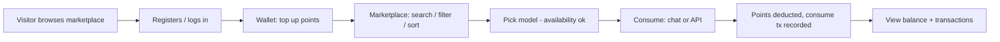
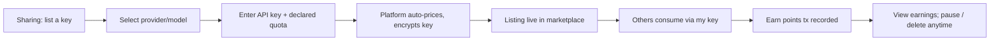
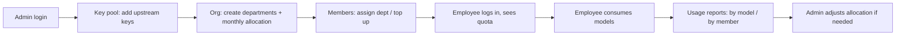
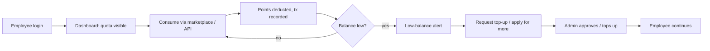

# AITokenPool — Product User Stories

> v1.0（2026-08-14）· Core product-design document. UI/backend implementations follow this document.
> Aligned with [docs/architecture.md](./architecture.md) and the UI prototype in [`ui/`](../ui/).

---

## 1. Product Model & Terminology

**One product, two deployment scenarios** (not two feature sets):

- **Public edition** — deployed on the public internet. Anyone can register, share idle API keys to earn points, and spend points to consume models shared by others.
- **Enterprise edition** — deployed on an internal network. The administrator (IT) puts purchased keys into the key pool and allocates monthly point quotas to members.

The feature set is **identical**; the difference is *who is motivated to share* (everyone in public; only the admin in enterprise). **Roles are permission differences, not product differences** — the admin additionally sees the Admin view (key pool / members / usage reports / organization), regular users do not.

### Core mechanism

| Term | Definition |
|---|---|
| **Point (点)** | The platform's unit of value. **1 USD = 1,000 points.** |
| **Key pool** | Upstream model API keys hosted by the platform (encrypted at rest). Enterprise: uploaded by admin. Public: uploaded by sharers. |
| **Listing (上架)** | A sharer lists an idle key with a declared quota. **The unit price is NOT set by the sharer** — the platform prices it automatically from the model price table (reference price = model output price, points / 1M tokens). |
| **Consumption (消费)** | A user spends points to call a model through the platform (chat / API). |
| **Earnings (收益)** | When someone consumes through a sharer's key, the sharer earns points. |
| **API Key (atk_)** | Platform-issued keys (`atk_live_…`) that let users/scripts call the platform API. Managed in Settings. |
| **Quota / allocation (配额/分配)** | Enterprise: monthly point quota per department and per member. |
| **Admin view** | Role-only view: key pool management, member management, usage reports, organization (department) management. |

### Architecture (from docs/architecture.md)

Centralized (方案 A): **the platform hosts keys and executes calls** — the platform is the only trusted executor. Metering is trustworthy, responses are real (direct upstream connection), and there is no tampering/cheating surface. Layered: Gateway (axum) · Key pool (encrypted) · Metering engine (token counting) · Ledger (points) · Marketplace (sharing) · Admin console (Web).

---

## 2. Role Definitions

### R1. Visitor / New User（访客 / 新用户）

| | |
|---|---|
| **Identity** | Unregistered person who reached the platform (public edition; also applies to a prospective employee in enterprise). |
| **Goals** | Understand what AITokenPool is, how points work, which models are available and at what price; register/login with minimal friction. |
| **Pain points** | No idea how AI token sharing works; fear of leaking their own API key; unclear pricing; registration friction (must choose a plan before seeing anything). |

### R2. Regular User, Public Edition（普通用户 · 公共版）

| | |
|---|---|
| **Identity** | Registered public user. |
| **Goals** | Get points (top up / earn), browse the marketplace, consume models (chat or API) with points, track balance and transactions. |
| **Pain points** | Balance runs out mid-task; no single place to see spend vs. earnings; expensive flagship models drain points quickly; not sure which shared key is reliable. |

### R3. Sharer（分享者 —— 公共版普通用户的一种行为角色）

| | |
|---|---|
| **Identity** | A regular public user who has idle subscription quota (Claude/ChatGPT/GLM/DeepSeek…) and wants to monetize it. |
| **Goals** | List an idle key in seconds (provider/model, declared quota, key — nothing else), have the platform price it, earn points when others consume, monitor earnings, pause/resume/relist/delete listings at will. |
| **Pain points** | Worries about key security (platform must encrypt & never display plaintext to others); worried about one user draining the quota; wants to stop sharing at any time; wants clarity on what they earned and why. |

### R4. Enterprise Admin（企业管理员）

| | |
|---|---|
| **Identity** | IT/administrator of an enterprise deployment (internal network). |
| **Goals** | Configure the key pool (add/revoke upstream keys), manage departments (CRUD + monthly point allocation), manage members (top-up, change department), review usage reports by model/member to control cost. |
| **Pain points** | Cost overrun by a few heavy users; members in the wrong department; keys hitting quota limits unnoticed; no visibility into which model consumes the budget; new members landing without a department. |

### R5. Enterprise Member（企业成员）

| | |
|---|---|
| **Identity** | An employee with points allocated by the admin. |
| **Goals** | Use models through one entry point with allocated points, view transactions, request more points when running low. |
| **Pain points** | Doesn't know how many points they have; gets blocked mid-work when quota runs out; unclear how to request more; no record of what they spent. |

---

## 3. User Stories

Format: **"As a \<role\>, I want \<capability\>, so that \<value\>."** Each story lists Acceptance Criteria (AC).

### 3.1 Visitor / New User

- **US-1** As a visitor, I want to browse the model marketplace before registering, so that I can evaluate models and prices first.
  - AC: Marketplace is browsable without login; search, provider filter, and sort (price/context) work; prices shown in points with USD/CNY reference.
- **US-2** As a visitor, I want to see a clear explanation of the points mechanism (1 USD = 1,000 points), so that I can decide whether to join.
  - AC: Points explanation visible from the landing/login page; conversion rate stated explicitly.
- **US-3** As a new user, I want to register/login with an email, so that I can start using the platform.
  - AC: Single login entry (no public/enterprise choice at login); registration creates an account with zero points; role (admin vs. user) is determined by the account.

### 3.2 Regular User（Public）

- **US-4** As a regular user, I want to top up points, so that I can consume models.
  - AC: Wallet shows current balance; top-up flow (placeholder per current prototype: 充值/提现 temporarily unsupported, "即将上线") reflects into balance and a "topup" transaction record.
- **US-5** As a regular user, I want to search/filter/sort the marketplace, so that I can quickly find the model I need.
  - AC: Search by model/provider; filter by provider; sort by input price asc/desc and by context size desc; availability shown.
- **US-6** As a regular user, I want to consume a model with points (chat/API), so that I can use the model without owning an upstream key.
  - AC: Selecting an available model opens chat/API entry; consumption deducts points per metered tokens × model price; a "consume" transaction is recorded; insufficient balance blocks the request with a clear message.
- **US-7** As a regular user, I want to view my transactions, so that I can reconcile my spend and earnings.
  - AC: Transactions page is the single source of truth for consume/earn/topup/withdraw; tabs (all/consume/earn) + MRT-style table with column sort, column filter, pagination; wallet page links to it.

### 3.3 Sharer

- **US-8** As a sharer, I want to list an idle key with just provider/model/declared quota, so that I can start earning points with minimal effort.
  - AC: Listing form requires provider, model, API key (password input), declared quota; reference price auto-computed from model price table (fallback default price if model has no pricing data — no error); platform stores key encrypted; key never shown in plaintext to others.
- **US-9** As a sharer, I want to see my listings with masked keys, quota usage, and earnings, so that I can monitor performance.
  - AC: Sharing page shows statistics + my listings (key masked like `sk-****1234`); each row shows used/quota, unit price, total earnings, status.
- **US-10** As a sharer, I want to pause/resume/relist/delete a listing, so that I control when my key is consumed.
  - AC: Pause = stop taking requests, resumable; delete = permanent removal from platform, irreversible, requires confirmation; relist reactivates a paused/off listing.
- **US-11** As a sharer, I want to know when my key is consumed, so that I can see earnings accumulating.
  - AC: Each consumption creates an "earn" transaction (partner model, tokens, +points); notification toggle in Settings ("共享 key 被消费时通知").

### 3.4 Enterprise Admin

- **US-12** As an enterprise admin, I want to add upstream keys to the key pool, so that members can use purchased models.
  - AC: Admin view → Key pool: add key (provider/model/key/quota); key shown masked; statuses ok / limit / exhausted / revoked; revoke disables a key immediately.
- **US-13** As an enterprise admin, I want to manage departments (CRUD + monthly point allocation), so that budget is distributed per organization structure.
  - AC: Organization tab: department list with member count, monthly allocation, used, remaining, status; add/edit/delete department; deleting a department leaves its members "unassigned" (未分配) — see E-03.
- **US-14** As an enterprise admin, I want to manage members (top-up / change department), so that individuals get the right quota and access.
  - AC: Member tab: change department via dropdown (existing departments + "未分配"); arbitrary top-up amount with **positive-integer validation**; new registered members default to "unassigned".
- **US-15** As an enterprise admin, I want usage reports by model and by member, so that I can control cost and spot heavy users.
  - AC: Usage tab shows by-model and by-member point consumption; numbers consistent with the ledger.
- **US-16** As an enterprise admin, I want to optionally close external registration, so that the enterprise deployment stays internal-only.
  - AC: Organization settings include "关闭外部注册（企业内网部署）" switch; when enabled, only invited/existing accounts can log in.

### 3.5 Enterprise Member

- **US-17** As an enterprise member, I want to log in and see my allocated points, so that I know my budget.
  - AC: Dashboard/wallet shows balance = allocation − consumed; monthly allocation visible.
- **US-18** As an enterprise member, I want to consume models through the same marketplace UI, so that I use any model from the key pool with one entry point.
  - AC: Same marketplace/chat/API flow as public; consumption deducts from member points; insufficient balance blocks with a clear message.
- **US-19** As an enterprise member, I want to view my transaction records, so that I can see what I spent and when.
  - AC: Transactions page lists consume records (and any admin top-up adjustments) with timestamps.
- **US-20** As an enterprise member, I want to request more points when my balance is low, so that I can keep working.
  - AC: Low-balance notification (Settings toggle); request flow (per prototype: "成员自助申请加额需管理员审批" toggle in org settings); request reaches admin.

### 3.6 Shared (all users) — API Key Management

- **US-21** As any user, I want to manage platform API keys (CRUD + one-click copy), so that I can integrate tools/scripts securely.
  - AC: Settings → API Key: generate with a name; rename; delete requires confirmation ("删除后该 key 立即失效"); search by name; list shows masked values (`atk_live_****xxxx`); copy provides the full value, with a `file://` fallback (select + Ctrl/Cmd+C) when clipboard API is restricted.

---

## 4. Key User Journeys

### J-1 Public: New user — register to first consumption

1. Visitor lands on the login page, browses models and pricing first (US-1, US-2).
2. Registers with email → account with 0 points (US-3).
3. Tops up in Wallet → balance updated, `topup` transaction (US-4).
4. Searches/filters/sorts the marketplace (US-5).
5. Picks an available model and consumes via chat/API (US-6).
6. Points deducted per metered tokens; checks Transactions for the record (US-7).

### J-2 Public: Sharer — upload key to first earning

1. Opens Sharing → “＋ 添加 / 上架新 key” (US-8).
2. Picks provider/model, pastes API key (password field), declares quota; reference price auto-computed.
3. Platform stores the key encrypted; listing goes live; key shown masked only (US-9).
4. Other users consume → sharer earns points, `earn` transaction + notification (US-11).
5. Sharer monitors earnings; pauses/resumes/re-lists/deletes at will (US-10).

### J-3 Enterprise: Admin — key pool to employees using models

1. Admin logs in and opens Admin view (role-gated) (US-12).
2. Adds upstream keys to the key pool; revokes bad keys (US-12).
3. Creates departments with monthly point allocation (US-13).
4. Assigns members to departments / tops up; new members default unassigned (US-14).
5. Employee logs in, sees allocated quota (US-17), consumes via marketplace (US-18).
6. Admin reviews usage reports by model/member and rebalances budget (US-15).

### J-4 Enterprise: Employee — login to consume to requesting more points

1. Employee logs in; dashboard shows balance (allocation − used) (US-17).
2. Consumes models through the same marketplace UI (US-18).
3. Every consumption deducts points and appears in Transactions (US-19).
4. On low balance, notification fires; employee applies for more points (US-20).
5. Admin tops up or adjusts quota; employee resumes (US-14).

---

## 5. Edge & Exception Scenarios

| # | Scenario | Expected behavior |
|---|---|---|
| E-01 | **Key invalid / revoked**（key 失效/被撤销） | Listing shows status (public: off/paused; enterprise: revoked); requests routed away from it; consumer sees "key unavailable" instead of an error loop; sharer/admin can re-upload or remove. |
| E-02 | **Quota exhausted**（额度用尽） | Key pool status → `exhausted` / listing stops taking requests; no further deduction attempted; admin sees limit/exhausted states to re-provision; consumer gets a clear "quota exhausted, pick another" message. |
| E-03 | **Department deleted**（部门被删除） | Members of the deleted department become **unassigned (未分配)**; they are not counted in any department summary; admin can re-assign them; their points balance is untouched. |
| E-04 | **Insufficient points**（点数不足） | Request is blocked before any upstream call; clear message with current balance and required points; no negative balance allowed; user is directed to top up / request more. |
| E-05 | **API key leak / compromise**（API Key 泄露） | Settings: delete key immediately (with confirmation, "删除后该 key 立即失效"); platform-issued keys are revocable and take effect instantly; users are encouraged to rotate; upstream keys are never exposed in plaintext anywhere in the UI. |
| E-06 | **New member, no department**（新成员未分配） | New registrations default to **unassigned**; they still receive the default member quota (per org settings); admin assigns them later. |
| E-07 | **Model with no pricing data**（模型无定价数据） | Listing still succeeds with the "default price" fallback; marketplace shows the price; later iterations may add pricing. |
| E-08 | **Top-up with invalid amount**（非法充值金额） | Admin arbitrary top-up validates **positive integer**; zero/negative/non-numeric input is rejected with a message. |
| E-09 | **Clipboard restricted (file://)**（剪贴板受限） | One-click copy falls back to select-the-key + Ctrl/Cmd+C guidance, so the user can still obtain the full key. |
| E-10 | **Single heavy user draining budget** | Usage reports (by member) surface it; admin can top up/adjust or change department allocation; low-balance alerts help the member self-regulate. |
| E-11 | **Availability flapping**（可用性抖动） | Marketplace shows `busy` availability for models with no ready key; retry/choose-another guidance; no silent failure. |
| E-12 | **Duplicate / conflicting listings of the same key** | Platform detects the same upstream key listed twice and warns the sharer; prevents double counting of the same quota. |

---

## 6. Alignment with UI Prototype & Architecture

| Aspect | Source of truth | Alignment |
|---|---|---|
| Pages / navigation | `ui/index.html` (Dashboard / Marketplace / Sharing / Wallet / Transactions / Settings + Admin role view) | Every story maps to a concrete page; Admin view is role-gated, others shared. |
| Points & pricing | `ui/js/data.js` (1 USD = 1,000 pts; model price table; reference price = output price points/1M) | US-2, US-8 use the same rules; no sharer-set pricing. |
| Key masking & security | `ui/js/data.js`, `ui/README.md` (masked keys, encrypted hosting, delete confirmation) | US-8, US-9, US-21, E-05 consistent. |
| Enterprise semantics | `ui/js/data.js` (key pool statuses, departments, members unassigned) | US-12…US-16, E-03, E-06 consistent. |
| Centralized architecture | `docs/architecture.md` (platform hosts keys, metering engine, ledger) | The whole doc assumes centralized execution; consumption/earnings flow through the platform ledger. |
| Transactions single-source | PR #8 (wallet/transactions dedup) | US-7: transactions page is the single detail entry; wallet links there. |

> **Note on later iterations**: if any UI/backend change diverges from this document, the divergence must be explained here (add a dated entry) and the document updated, because implementations follow this document.
